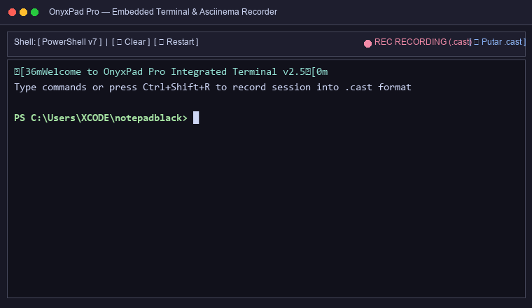

# OnyxPad — Editor Split Panes Pro

<p align="center">
  
</p>

**[English](README.md)** · [Laporkan Bug / Usulkan Fitur](https://github.com/jpXproject/OnyxPad/issues)


-41CD52?logo=qt&logoColor=white)


Notepad hitam bertema gelap yang di-upgrade penuh, dibangun dengan **PySide6
(Qt6)**. Split panes bertingkat gaya tmux / VS Code, tab per pane, syntax
highlighting multi-bahasa, find &amp; replace, **edit multi-kursor**, 7 tema kontras tinggi,
preview media (gambar & video), Quick Action Toolbar, perekam terminal Asciinema, dan penjelajah folder.

---

## Fitur

| Area | Fitur |
|---|---|
| **Split panes** | `Ctrl+\` split kanan, `Ctrl+'` split bawah — bisa bertingkat, gaya tmux/VS Code |
| **Tab per pane** | Setiap pane punya tab sendiri (drag untuk pindah posisi, opsi tutup tab context menu) |
| **Quick Action Toolbar** | Tombol aksi cepat untuk Tab Baru, Buka File, Buka Folder, Simpan, Split, Cari, Terminal & Asciinema Recorder |
| **Preview Media** | Klik dua kali file gambar (`.png`, `.jpg`, `.gif`, `.svg`, `.webp`) atau video (`.mp4`, `.webm`, `.avi`, `.mkv`) di File Explorer untuk memutar/melihat langsung di tab editor |
| **Syntax highlighting** | Python, JS/TS, HTML, CSS, C/C++, Java, JSON, Markdown, Shell, YAML, SQL — auto-deteksi dari ekstensi |
| **Find & replace** | `Ctrl+F` / `Ctrl+H`, opsi Aa / kata utuh / regex, hitung jumlah cocok, Ganti Semua |
| **Multi-kursor** | `Ctrl+D` pilih kata / kemunculan berikutnya, `Ctrl+U` buang kursor terakhir, `Esc` selesai — ketik/backspace/Enter berlaku di semua kursor sekaligus |
| **Editor pro** | Nomor baris, highlight baris aktif, pencocokan kurung, auto-pair `(){}[]""`, tab stop, auto-indent, komentari `Ctrl+/` |
| **Tema Kontras Tinggi** | 7 tema: Dracula, One Dark, Monokai, Matrix Green, Nord, Solarized Dark, Light — warna teks diperbaiki agar selalu terbaca |
| **Terminal Terintegrasi** | Panel terminal di bagian bawah (`Ctrl+\``) mendukung PowerShell / CMD / Bash dengan warna ANSI |
| **Perekam Asciinema** | Rekam sesi terminal ke format standar asciinema `.cast` v2 (`Ctrl+Shift+R`) secara *multithreaded* (`QThread`) & putar ulang di player bawaan |
| **Bantuan & pembaruan** | Dialog pembaruan berdesain Dark UI dengan integrasi GitHub Releases API |

### Terminal Terintegrasi & Asciinema Recorder

OnyxPad dilengkapi terminal terintegrasi (`Ctrl+\``) dengan dukungan warna ANSI penuh (PowerShell, CMD, Bash) serta **Asciinema Recorder (`Ctrl+Shift+R`)** bawaan. Sesi terminal yang direkam disimpan ke format standar `.cast` v2 dan dapat diputar kembali secara langsung di **Asciinema Player** bawaan!

<p align="center">
  
</p>

Contoh file rekaman asciinema: [`docs/demo/onyxpad_terminal_demo.cast`](docs/demo/onyxpad_terminal_demo.cast)

### Split panes


### Tema

7 tema yang disetel halus, bisa diganti dari menu dan diingat lintas sesi.
Enam tema gelap berikut (tema **Light** tersedia di menu):

| **Dracula (Default)** — tampilan khas | **One Dark** |
|---|---|
|  |  |

| **Monokai** | **Matrix Green** |
|---|---|
|  |  |

| **Nord** | **Solarized Dark** |
|---|---|
|  |  |

---

## Memulai

### Prasyarat

- **Python 3.10+** dan **PySide6** (`pip install PySide6`)

### Menjalankan dari source

```bash
git clone https://github.com/jpXproject/OnyxPad.git
cd OnyxPad
pip install PySide6
python main.py
```

Atau bangun `dist/OnyxPad.exe` sendiri (lihat bagian Build di bawah).

### Pintasan

| Tombol | Aksi |
|---|---|
| `Ctrl+\` / `Ctrl+'` | Split kanan / split bawah |
| `Ctrl+Tab` / `Alt+←↑→↓` | Pane berikutnya / fokus pane ke arah |
| `Ctrl+D` / `Ctrl+U` | Tambah kursor berikutnya / buang kursor terakhir |
| `Ctrl+F` / `Ctrl+H` / `F3` | Cari / Ganti / Cari berikutnya |
| `Ctrl+S` / `Ctrl+Shift+S` / `Ctrl+Alt+S` | Simpan / Simpan sebagai / Simpan semua |
| `Ctrl+T` / `Ctrl+W` / `Ctrl+Shift+W` | Tab baru / tutup tab / tutup pane |
| `Ctrl+P` / `Ctrl+G` / `Ctrl+/` | Buka cepat / pergi ke baris / komentari |
| `Ctrl+wheel` / `Ctrl+0` | Zoom / reset zoom |
| `F1` | Referensi pintasan lengkap (di dalam app) |

---

## Pengembangan

### Menjalankan test

```bash
pip install pytest pytest-qt
pytest
```

148 test mencakup: editor (auto-pair, indentasi, komentar, multi-kursor,
I/O file), find & replace, UI SearchBar (pytest-qt), syntax highlighting,
tema/QSS, sistem split panes, dan integrasi aplikasi.

### Membangun .exe mandiri

```bash
pip install pyinstaller
python build.py            # satu file  -> dist/OnyxPad.exe
python build.py folder     # folder     -> dist/OnyxPad/OnyxPad.exe
```

Di Windows cukup klik dua kali **`build.bat`** (build satu file). Nama & versi
aplikasi dibaca dari `src/version.py` dan tampil di status bar serta dialog
Tentang.

### Mengambil ulang screenshot / video demo

```bash
python tools/take_screenshots.py    # docs/screenshots/*.png (Qt offscreen)
python tools/record_demo.py         # docs/demo/demo.mp4 + demo.gif (butuh ffmpeg)
```

Keduanya merender aplikasi secara headless dan menangkap kondisi UI asli —
tanpa edit manual.

### Struktur proyek

```
main.py              Entry point
src/
  app.py             Jendela utama, menu, status bar, sesi
  editor.py          Editor kode: multi-kursor, auto-pair, tab stop, komentar
  panes.py           Pengelola split pane bertingkat (gaya tmux)
  search.py          Bar cari & ganti
  syntax.py          Syntax highlighting multi-bahasa
  themes.py          7 tema + builder QSS global
  filetree.py        Sidebar penjelajah file
  version.py         Nama, tagline, versi aplikasi
tests/               Suite pytest (148 test)
tools/               Skrip tangkap screenshot & video demo
docs/                Screenshot, media demo, file contoh
```

---

Dibuat dengan ❤️ menggunakan PySide6 (Qt6).
