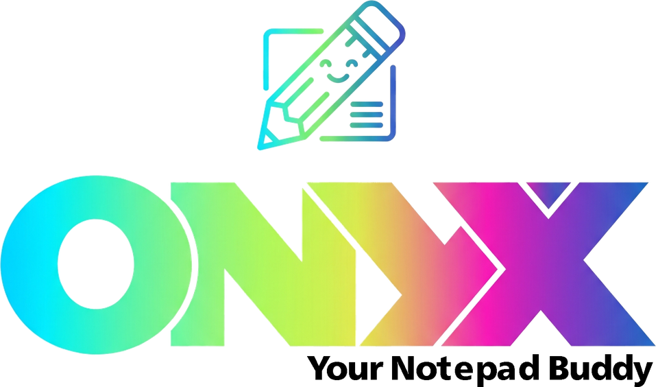
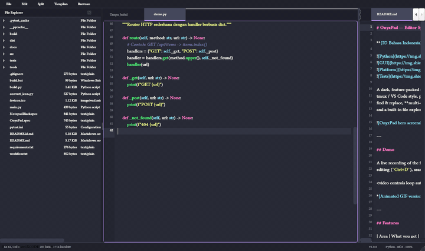
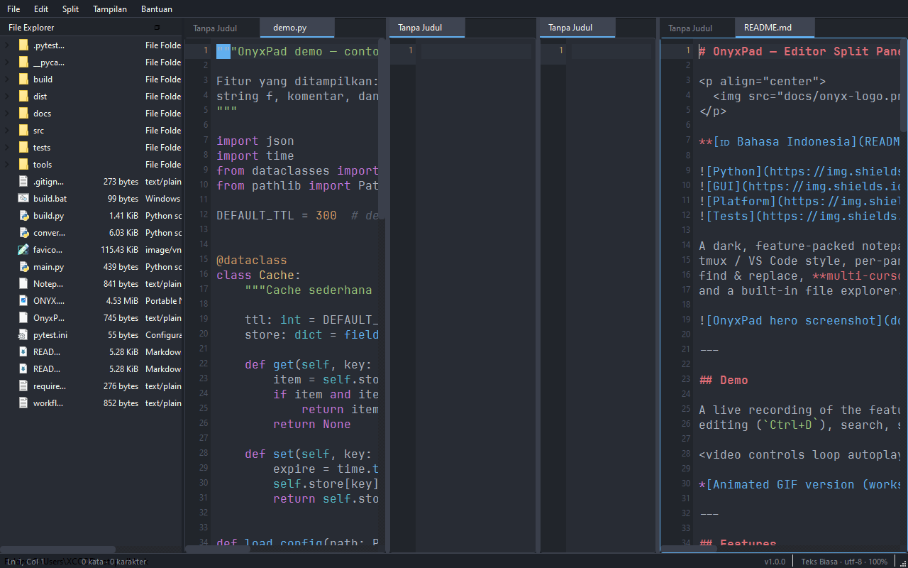
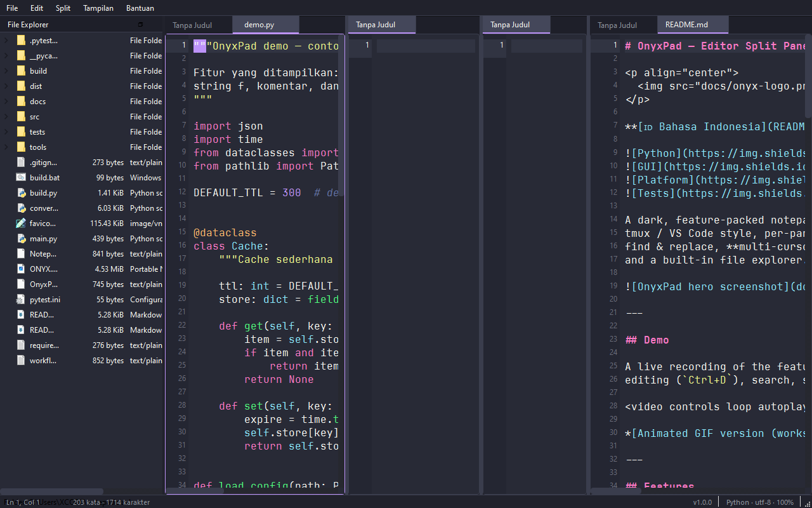
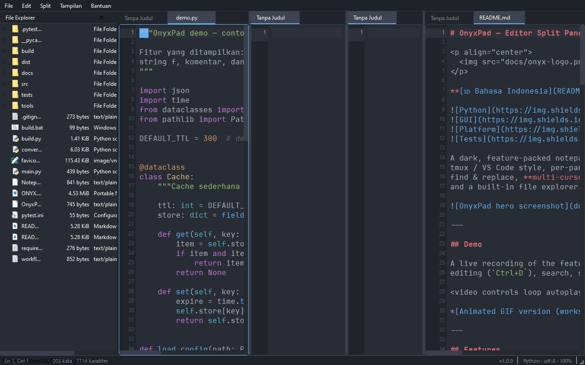
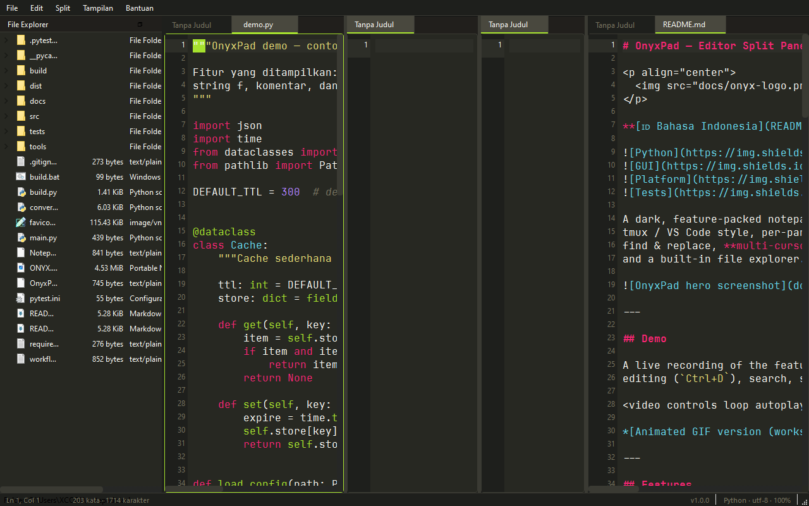
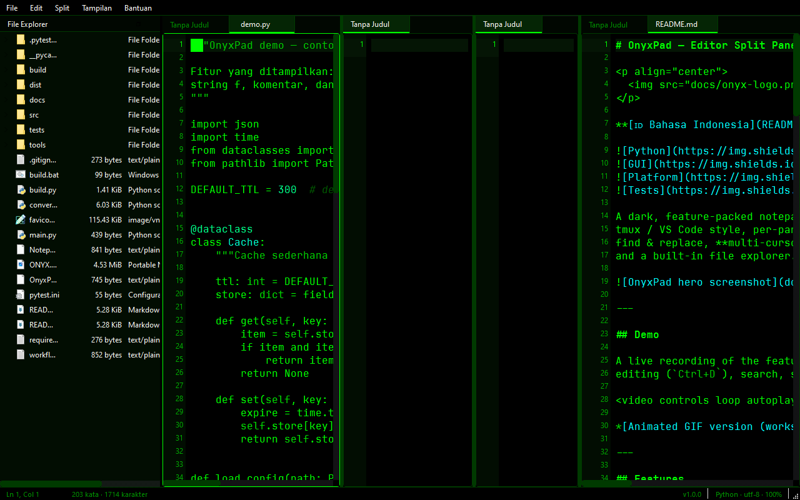
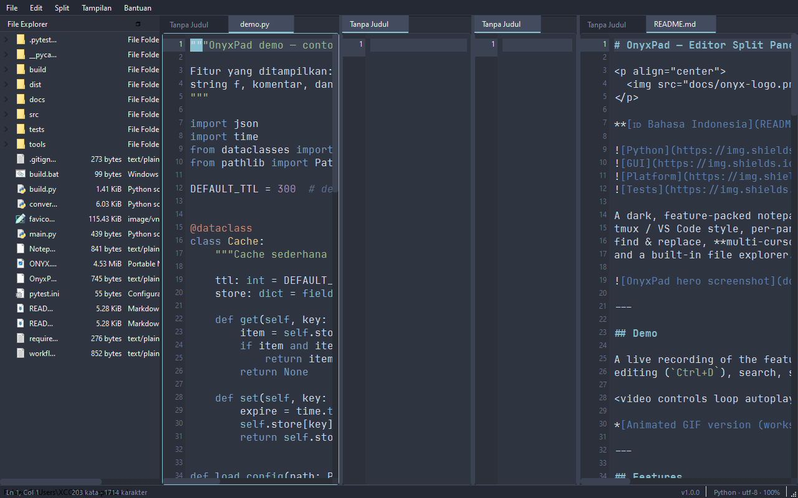
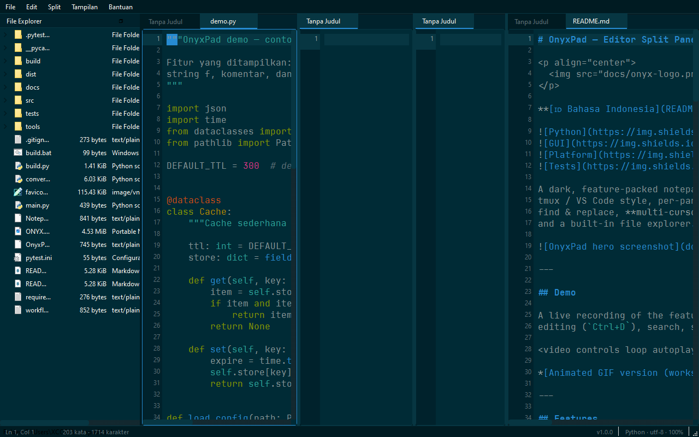

# OnyxPad — Editor Split Panes Pro

<p align="center">
  
</p>

**[🇮🇩 Bahasa Indonesia](README.id.md)** · [Report a Bug / Request a Feature](https://github.com/jpXproject/OnyxPad/issues)


-41CD52?logo=qt&logoColor=white)


A dark, feature-packed notepad built with **PySide6 (Qt6)**. Split panes in a
tmux / VS Code style, per-pane tabs, multi-language syntax highlighting,
find & replace, **multi-cursor editing**, 7 themes, auto session restore,
and a built-in file explorer. The app opens in the signature **Dracula
theme** — here's a live recording:

<p align="center">
  
</p>

*Feature tour: auto-pair typing, multi-cursor (`Ctrl+D`), search highlight,
split panes, and theme switching.*

---

## Features

| Area | What you get |
|---|---|
| **Split panes** | `Ctrl+\` split right, `Ctrl+'` split below — nestable, tmux/VS Code style |
| **Tabs per pane** | Each pane has its own tab bar (drag tabs to reorder) |
| **Syntax highlighting** | Python, JS/TS, HTML, CSS, C/C++, Java, JSON, Markdown, Shell, YAML — auto-detected from the extension |
| **Find & replace** | `Ctrl+F` / `Ctrl+H`, case / whole-word / regex options, match count, Replace All |
| **Multi-cursor** | `Ctrl+D` select word / next occurrence, `Ctrl+U` drop the last cursor, `Esc` to finish — typing, backspace and Enter apply to every cursor at once |
| **Pro editing** | Line numbers, active-line highlight, bracket matching, auto-pair `(){}[]""` (incl. quote overtype), tab-stop jump out of pairs, auto-indent, comment toggle `Ctrl+/` |
| **Themes** | 7 themes: Dracula, One Dark, Monokai, Matrix Green, Nord, Solarized Dark, Light — persisted across sessions |
| **File explorer** | Sidebar (`Ctrl+Shift+O`), double-click to open, right-click to open in a new pane |
| **Sessions** | Split layout + open files + theme restored automatically (`~/.onyxpad/settings.json`) |
| **Extras** | Quick Open `Ctrl+P`, recent files, drag & drop files, status bar (Ln/Col/words/encoding/language/zoom/version), zoom `Ctrl+wheel` |

### Split panes



### Themes

7 hand-tuned themes, switchable from the menu and remembered across
sessions. All six dark themes (the **Light** theme is available in the menu):

| **Dracula (Default)** — the signature look | **One Dark** |
|---|---|
|  |  |

| **Monokai** | **Matrix Green** |
|---|---|
|  |  |

| **Nord** | **Solarized Dark** |
|---|---|
|  |  |

---

## Getting Started

### Requirements

- **Python 3.10+** and **PySide6** (`pip install PySide6`)

### Run from source

```bash
git clone https://github.com/jpXproject/OnyxPad.git
cd OnyxPad
pip install PySide6
python main.py
```

Or grab the ready-to-run `dist/OnyxPad.exe` by building it yourself (see below).

### Shortcuts

| Keys | Action |
|---|---|
| `Ctrl+\` / `Ctrl+'` | Split right / split below |
| `Ctrl+Tab` / `Alt+←↑→↓` | Next pane / focus pane in direction |
| `Ctrl+D` / `Ctrl+U` | Add next cursor / drop last cursor |
| `Ctrl+F` / `Ctrl+H` / `F3` | Find / Replace / Find next |
| `Ctrl+S` / `Ctrl+Shift+S` / `Ctrl+Alt+S` | Save / Save as / Save all |
| `Ctrl+T` / `Ctrl+W` / `Ctrl+Shift+W` | New tab / close tab / close pane |
| `Ctrl+P` / `Ctrl+G` / `Ctrl+/` | Quick open / go to line / toggle comment |
| `Ctrl+wheel` / `Ctrl+0` | Zoom / reset zoom |
| `F1` | Full shortcut reference (in-app) |

---

## Development

### Run the test suite

```bash
pip install pytest pytest-qt
pytest
```

148 tests covering: editor (auto-pair, indentation, comments, multi-cursor,
file I/O), find & replace, SearchBar UI (pytest-qt), syntax highlighting,
themes/QSS, split-panes system, and app integration.

### Build the standalone .exe

```bash
pip install pyinstaller
python build.py            # single file -> dist/OnyxPad.exe
python build.py folder     # folder      -> dist/OnyxPad/OnyxPad.exe
```

On Windows you can just double-click **`build.bat`** (single-file build).
App name & version come from `src/version.py` and are shown in the status bar
and the About dialog.

### Regenerate screenshots / demo video

```bash
python tools/take_screenshots.py    # docs/screenshots/*.png (Qt offscreen)
python tools/record_demo.py         # docs/demo/demo.mp4 + demo.gif (needs ffmpeg)
```

Both render the app headlessly and capture real UI state — no manual editing.

### Project layout

```
main.py              Entry point
src/
  app.py             Main window, menus, status bar, sessions
  editor.py          Code editor: multi-cursor, auto-pair, tab stop, comments
  panes.py           Nestable split-pane manager (tmux style)
  search.py          Find & replace bar
  syntax.py          Multi-language syntax highlighting
  themes.py          7 themes + global QSS builder
  filetree.py        File explorer sidebar
  version.py         App name, tagline, version
tests/               pytest suite (148 tests)
tools/               Screenshot & demo video capture scripts
docs/                Screenshots, demo media, sample file
```

---

Built with ❤️ on PySide6 (Qt6).
